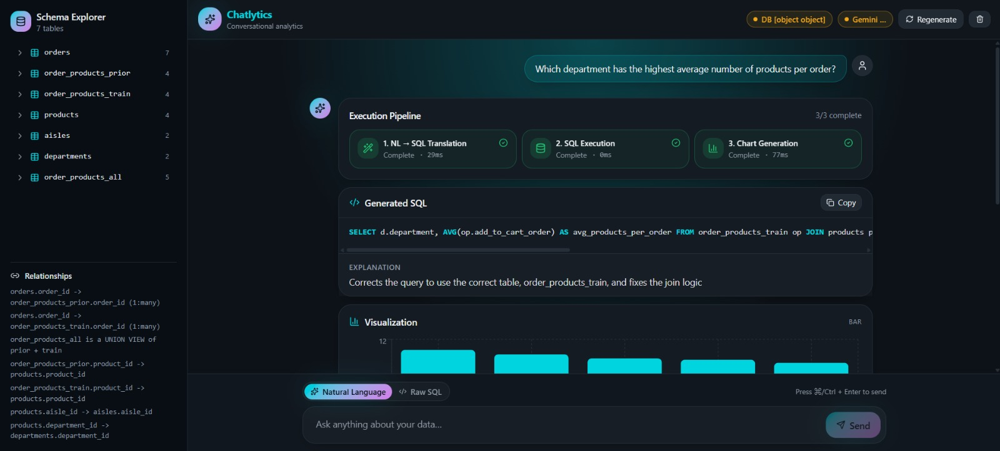
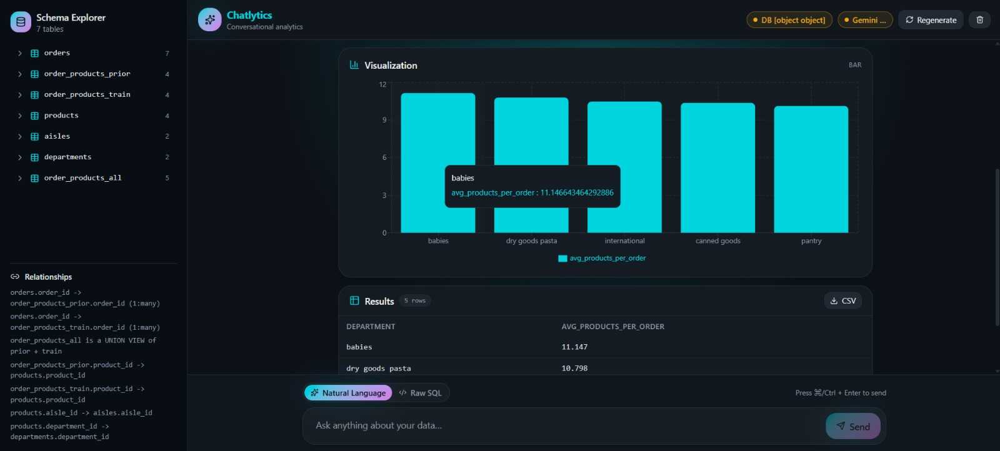
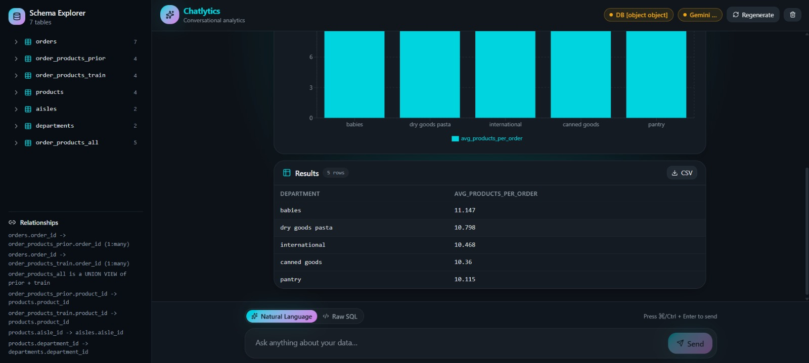

# 🚀 Chatlytics — Conversational BI with Real-Time Streaming

Chatlytics is a real-time Conversational Business Intelligence platform that transforms natural language questions into SQL queries, executes them on large-scale datasets, and returns interactive charts, tables, and insights — with full transparency via a streaming execution pipeline.

Built on the Instacart Market Basket Analysis dataset (~33M+ records), Chatlytics enables you to **chat with your data** and watch each step unfold live.

---

## ✨ Key Features

- 💬 **Chat-based Analytics**
  - Ask questions in plain English
  - Supports multi-turn conversations with context

- ⚡ **Real-Time Streaming (SSE)**
  - Live execution pipeline:
    - NL → SQL Translation
    - SQL Execution
    - Chart Generation

- 🧠 **AI-Powered SQL Generation**
  - Uses LLM (Ollama - Llama 3.2)
  - Schema-aware + few-shot prompting

- 📊 **Dynamic Data Visualization**
  - Auto-generated charts (Bar, Line, Pie)
  - Recharts-compatible JSON rendering

- 📋 **Structured Data Tables**
  - Clean tabular output with row counts

- 🧾 **SQL Transparency**
  - View generated SQL
  - Explanation + reasoning steps

- 🗂️ **Schema Explorer**
  - Explore tables, columns, and relationships

- 🛠️ **Raw SQL Mode**
  - Execute custom SQL queries directly

---

## 🎬 Demo





 
## Setup
 
### Prerequisites
 
- Python 3.10+
- Node.js 18+ (for frontend)
- Ollama installed locally
- Instacart dataset (6 CSV files)
 
### 1. Clone and install backend dependencies
 
```bash
cd backend
pip install -r requirements.txt
```
 
### 2. Add your CSVs
 
```
project-root/
├── backend/
├── frontend/
└── data/               ← place all 6 CSVs here
    ├── orders.csv
    ├── order_products__prior.csv
    ├── order_products__train.csv
    ├── products.csv
    ├── aisles.csv
    └── departments.csv
```
 
### 4. Start the backend
 
```bash
cd backend
uvicorn main:app --reload --port 8000
```
 
You should see:
```
✓ orders:                3,421,083 rows
✓ order_products_prior: 32,434,489 rows
✓ order_products_train:  1,384,617 rows
✓ products:                 49,688 rows
✓ aisles:                     134 rows
✓ departments:                 21 rows
✓ order_products_all (prior + train): 33,819,106 rows
```
 
### 5. Start the frontend
 
```bash
cd frontend
npm install
npm run dev
```
 
Open **http://localhost:5173** in your browser.
 
---
